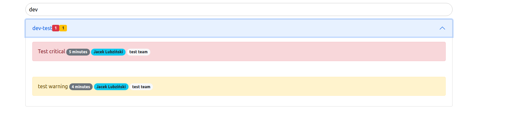

# pagerduty-status-page
Public status page for PagerDuty business services (use only in local neworks)

# Deployment
Public docker image available on docker hub https://hub.docker.com/repository/docker/jlubzinski/pagerduty-status-page

docker compose deployments/docker-compose.yml requires environment variables to work
```
# required
PDSTATUS_PAGER_DUTY_AUTH_TOKEN:
```
# UI
- Search
- Number of warnings (yelow)
- Number of criticals (red)
- Incident title
- How long ago was incident created
- Assigne
- Team 

